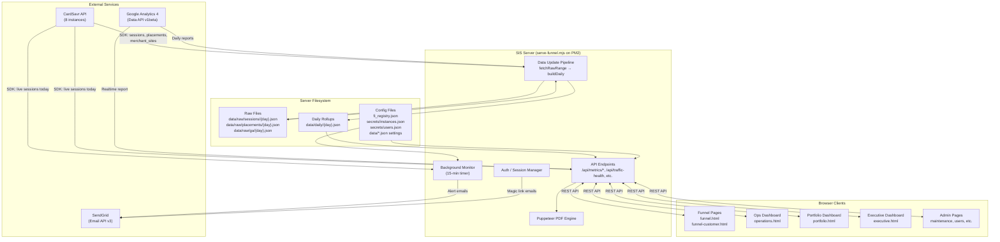
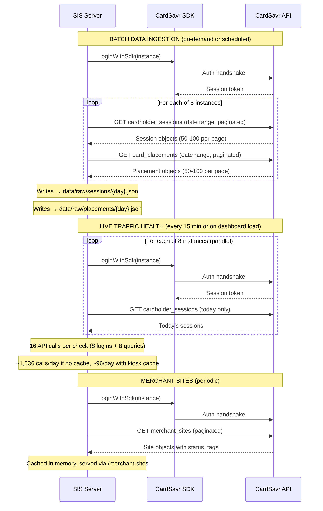
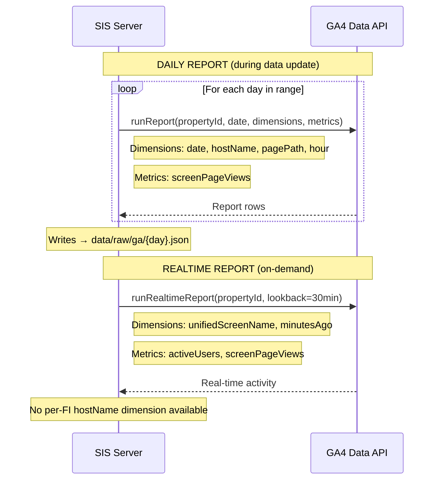
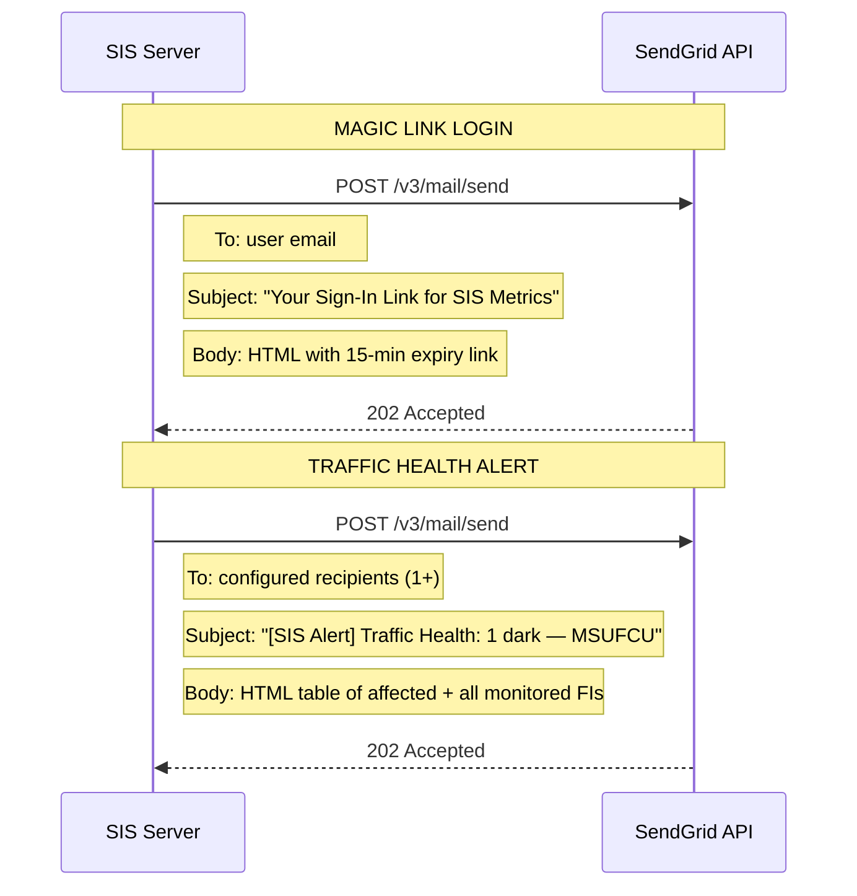
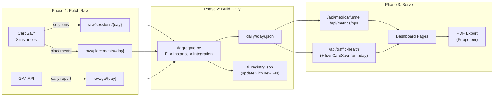
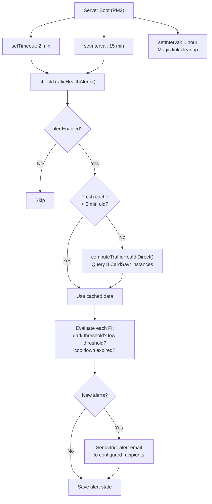

# SIS Architecture — Data Flows & External API Calls

## System Overview



---

## CardSavr API Calls

Every call requires SDK authentication: `loginWithSdk(instanceConfig)` → establishes a `CardsavrSession`.



### CardSavr Call Inventory

| Trigger | SDK Call | Instances | Pages/Call | Frequency |
|---------|---------|-----------|------------|-----------|
| Data Update (`/run-update/start`) | `cardholder_sessions` | 8 | 1-5 per inst | On-demand (admin) |
| Data Update (`/run-update/start`) | `card_placements` | 8 | 1-5 per inst | On-demand (admin) |
| Traffic Health (`/api/traffic-health`) | `cardholder_sessions` | 8 | 1 per inst | Dashboard load (2-min cache) |
| Background Alert Monitor | `cardholder_sessions` | 8 | 1 per inst | Every 15 min (if no cache) |
| Merchant Sites (`/merchant-sites`) | `merchant_sites` | 1 | 1-3 | Periodic refresh |
| Instance Test (`/instances/test`) | Auth only | 1 | 0 | On-demand (admin) |

---

## Google Analytics API Calls



### GA Call Inventory

| Trigger | API Method | Frequency | Data Freshness |
|---------|-----------|-----------|----------------|
| Data Update | `runReport` | Per day in range | 4-8 hour lag |
| Realtime endpoint (`/api/realtime-ga`) | `runRealtimeReport` | On-demand | Real-time (no per-FI breakdown) |
| GA credential test | `runReport` (today) | On-demand (admin) | N/A |

---

## SendGrid Email Calls



| Trigger | Frequency | Recipients |
|---------|-----------|------------|
| User login request | On-demand | Single user |
| Traffic alert (background) | Up to every 15 min (with cooldown) | Configured admin list |

---

## Data Pipeline



### Data Freshness by Source

| Data Type | Source | Freshness | Update Method |
|-----------|--------|-----------|---------------|
| Sessions & Placements | CardSavr SDK (batch) | On-demand refresh | `/run-update/start` |
| Sessions (today only) | CardSavr SDK (live) | 2-min cache | `/api/traffic-health` |
| GA Page Views | GA4 Data API | 4-8 hour lag | During data update |
| GA Realtime | GA4 Realtime API | Real-time | `/api/realtime-ga` |
| FI Registry | Derived from raw data | On update | Auto-sync during build |
| Merchant Sites | CardSavr SDK | Periodic | In-memory cache |

---

## Background Processes



---

## Client → Server API Map

### Dashboard Pages and Their API Calls

| Page | Endpoints Called | Auth Required |
|------|----------------|---------------|
| **funnel-customer.html** | `/api/metrics/funnel`, `/fi-registry`, `/api/share-settings`, `/api/filter-options` | Yes |
| **funnel.html** | `/api/metrics/funnel`, `/fi-registry`, `/api/share-settings`, `/api/filter-options` | Yes |
| **operations.html** | `/api/metrics/ops`, `/api/metrics/ops-feed`, `/api/traffic-health`, `/api/filter-options` | Yes |
| **portfolio.html** | `/api/metrics/funnel`, `/api/metrics/ops`, `/fi-registry` | Yes |
| **executive.html** | `/api/metrics/funnel`, `/api/metrics/ops`, `/fi-registry` | Yes |
| **supported-sites.html** | `/merchant-sites`, `/api/share-settings` | Yes |
| **maintenance.html** | `/api/share-settings`, `/api/traffic-health-settings`, `/run-update/*`, `/ga/*`, `/instances/*` | Admin |
| **users.html** | `/api/users`, `/api/user-access-options` | Admin |
| **troubleshoot.html** | `/troubleshoot/day`, `/troubleshoot/options` | Admin |
| **synthetic-traffic.html** | `/api/synth/jobs`, `/api/synth/status`, `/api/synth/jobs/{id}/sessions` | Admin |
| **shared-views.html** | `/analytics/shared-views` | Admin |
| **Share link (view mode)** | `/api/share-validate`, `/api/metrics/funnel` | No (share sid) |

---

## File System Layout

```
strivve-metrics/
├── scripts/
│   └── serve-funnel.mjs          # Main server (~6500 lines)
├── src/
│   ├── api.mjs                   # CardSavr SDK wrapper (loginWithSdk)
│   └── ga.mjs                    # GA4 API wrapper
├── secrets/
│   ├── instances.json            # CardSavr instance credentials (8 instances)
│   ├── users.json                # User accounts + access levels
│   ├── ga-service-account.json   # Google Analytics credentials
│   └── sessions.json             # Active auth sessions (transient)
├── data/
│   ├── raw/
│   │   ├── sessions/{day}.json   # Raw CardSavr sessions
│   │   ├── placements/{day}.json # Raw CardSavr placements
│   │   └── ga/{day}.json         # Raw GA4 daily reports
│   ├── daily/{day}.json          # Computed rollups (FI × instance × integration)
│   ├── share-settings.json       # Share link TTL config
│   ├── traffic-health-settings.json  # Alert thresholds + recipients
│   ├── traffic-alert-state.json  # Per-FI alert cooldown tracking
│   ├── share-log.jsonl           # Share link audit trail
│   ├── activity.log              # User action audit trail
│   └── synthetic/jobs.json       # Synthetic traffic job configs
├── fi_registry.json              # FI metadata registry (auto-updated)
├── public/                       # Static frontend files
│   ├── dashboards/               # Dashboard HTML pages
│   └── assets/                   # JS, CSS, images
└── templates/                    # PDF report templates
```
